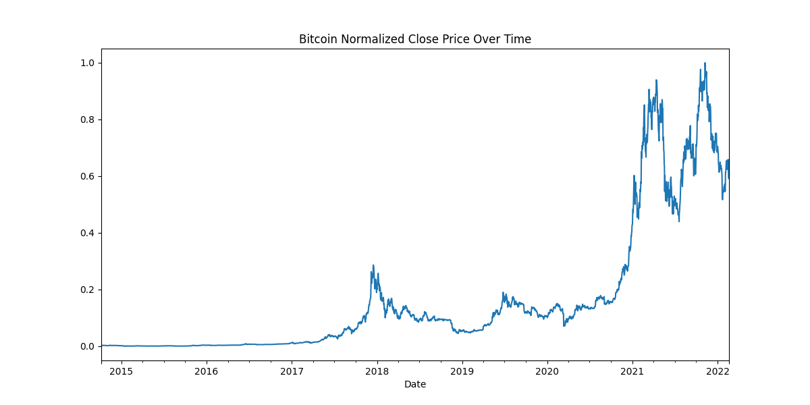
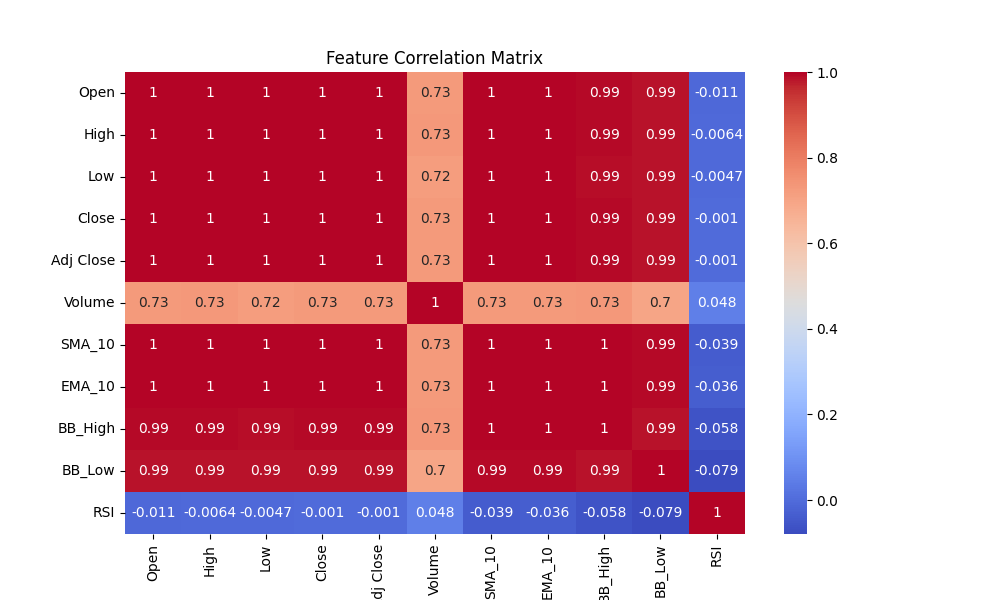

# Bitcoin Price Trend Prediction

This project uses historical Bitcoin data and machine learning models to predict price trends and assist traders in making informed decisions.

## 📊 Features
- Preprocessing and normalization of time-series data
- Technical indicators: SMA, EMA, RSI, Bollinger Bands
- ML Models: Linear Regression, Random Forest, SVM, XGBoost
- Model evaluation with MAE, MSE, RMSE, R²

## 🛠️ Tech Stack
- Python
- Pandas, NumPy, Scikit-learn
- XGBoost, TA-Lib
- Matplotlib, Seaborn

## 🚀 How to Run

1. Clone the repo:
   ```bash
   git clone https://github.com/your-username/bitcoin-price-prediction.git
   cd bitcoin-price-prediction


